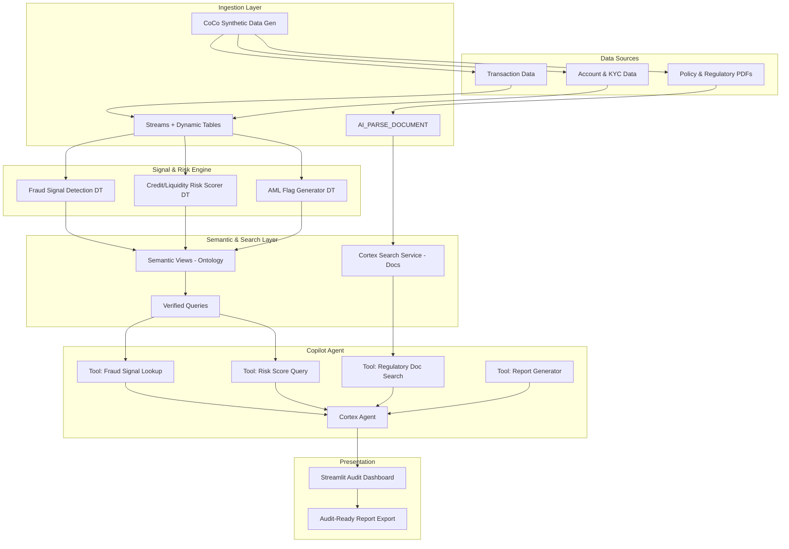

# Architecture: Risk, Fraud and Regulatory Intelligence Copilot

## Problem Statement

Banking/NBFC compliance teams manually process fraud signals, assess credit/liquidity risk, and produce regulatory reports (AML, Basel). Build a copilot that surfaces risk and fraud signals from structured data, grounds answers in regulatory policy documents, and produces audit-ready outputs — all from natural language questions.

## Architecture Diagram

## Components

| Component                       | Purpose                                                         | Justification                                                         |
| ------------------------------- | --------------------------------------------------------------- | --------------------------------------------------------------------- |
| CoCo Synthetic Data Gen         | Generate realistic banking data                                 | Hackathon constraint — no prod data; demonstrates CoCo planning phase |
| Streams + Dynamic Tables        | Incremental ingestion & transformation                          | Near-real-time signal detection; idempotent refresh; Snowflake-native |
| Fraud Signal Detection DT       | Flag suspicious patterns (velocity, amount anomalies)           | Core business logic — surfaces signals from raw transactions          |
| Credit/Liquidity Risk Scorer DT | Compute risk scores per account                                 | Required for regulatory reporting and NBA                             |
| AML Flag Generator DT           | Identify AML-relevant patterns                                  | Regulatory requirement — must be auditable                            |
| AI\_PARSE\_DOCUMENT             | Extract text from policy/regulatory PDFs                        | Enables unstructured doc search without external tools                |
| Cortex Search Service           | Semantic search over regulatory corpus                          | Grounds agent answers in policy evidence                              |
| Semantic Views (Ontology)       | Business entity model: Account→Transaction→Alert→Finding→Report | Governs definitions; ensures consistent answers across users          |
| Verified Queries                | Pre-validated SQL for common compliance questions               | Trustworthy, governed, auditable query paths                          |
| Cortex Agent                    | NL interface with tool-calling                                  | Central copilot — routes questions to appropriate tools               |
| Streamlit Dashboard             | Compliance user interface                                       | Visual evidence chains, report export, conversation history           |

## Data Flow

1. **Synthetic data generated** via CoCo → lands in raw stage/tables (transactions, accounts, policy docs)
2. **Streams detect changes** → trigger Dynamic Tables for fraud signals, risk scores, AML flags
3. **Policy documents parsed** via AI\_PARSE\_DOCUMENT → chunks indexed in Cortex Search Service
4. **Semantic views** define the ontology over processed tables (Account→Transaction→Alert→Finding)
5. **User asks a question** in Streamlit (e.g., "Which accounts triggered AML alerts this week?")
6. **Cortex Agent** routes to appropriate tool: structured query via semantic view OR doc search via Cortex Search
7. **Agent assembles response** with evidence citations (table rows + document excerpts)
8. **Response rendered** in Streamlit with explainability panel and "Export as Audit Report" action
9. **Report generated** as structured finding with signal → evidence → conclusion chain

## Rules

1. **Single responsibility** — each Dynamic Table handles one signal type (fraud, risk, AML separately)
2. **Managed over custom** — Cortex Search, Cortex Agent, Dynamic Tables are all managed services; zero infra to maintain
3. **No speculative additions** — no ML model training, no external APIs, no Kafka; only what the demo requires
4. **Idempotent operations** — Dynamic Tables are declarative and safely re-runnable; streams handle exactly-once semantics
5. **Observable by default** — Dynamic Table refresh history, agent tool call logs, Streamlit session tracking
6. **Fail-safe defaults** — agent returns "insufficient evidence" rather than hallucinating; confidence thresholds on all outputs
7. **Least privilege** — agent service role has SELECT-only on processed tables; no raw data access
8. **Standard protocols** — all queries are SQL via semantic views; agent uses standard Cortex tool-calling interface

## Constraints

1. **Minimum components** — 11 components total; each justified in table above; no message queues, no external compute
2. **No redundant data copies** — raw → processed (DTs are views, not copies); documents indexed once in Cortex Search
3. **Latency budget** — NL question to answer: <10s total; agent routing <1s, SQL execution <4s, doc search <3s, assembly <2s
4. **Blast radius** — if Cortex Search is down, structured queries still work; if a DT fails, stale data is served with a warning
5. **Cost proportionality** — all serverless (DTs, Cortex Search, Agent); cost = 0 when idle; scales with query volume
6. **Recovery target** — DTs: re-refresh from source (RTO <5min); Cortex Search: re-index from stage (RTO <15min)

## Workflow/Template

### Phase 1: Foundation & Synthetic Data (CoCo Planning + Data Gen)

- Use CoCo to explore the problem space, draft schema design

- Generate synthetic datasets via CoCo:

  - `transactions` (id, account\_id, amount, timestamp, merchant, category, country, fraud\_label)
  - `accounts` (id, name, type, kyc\_status, risk\_tier, opened\_date)
  - `kyc_records` (account\_id, doc\_type, verified\_date, flags)
  - Regulatory docs: AML policy PDF, Basel III summary, internal fraud policy

- Load into Snowflake stage and raw tables

- **Verification**: `SELECT COUNT(*) FROM raw.transactions` returns >10K rows; docs visible on stage

### Phase 2: Signal Detection Pipelines (CoCo Development)

- Create Dynamic Tables via CoCo:

  - `fraud_signals`: velocity checks (>5 txns in 1 min), amount anomalies (>3σ from account mean), geo-impossibility
  - `risk_scores`: credit exposure aggregation, liquidity ratio per account
  - `aml_flags`: structuring detection (<$10K splits), high-risk country flows, PEP matches

- Create streams on raw tables for incremental refresh

- **Verification**: Insert test transactions → confirm DTs refresh with correct signals within target lag

### Phase 3: Document Processing & Search (CoCo Development)

- Upload regulatory PDFs to internal stage
- Use AI\_PARSE\_DOCUMENT to extract text
- Create Cortex Search Service over parsed document chunks
- Test retrieval: "What is the SAR filing threshold?" → returns correct policy section
- **Verification**: Search returns relevant chunks with >0.7 similarity for 5 test queries

### Phase 4: Semantic Model & Ontology (CoCo Development)

- Author semantic views via CoCo:

  - Entities: Account, Transaction, FraudSignal, RiskScore, AMLFlag, Finding
  - Relationships: Account has many Transactions; Transaction triggers FraudSignal; FraudSignal escalates to Finding
  - Metrics: total\_exposure, alert\_count, avg\_risk\_score, false\_positive\_rate

- Create verified queries for top compliance questions:

  - "Accounts with highest fraud signal concentration"
  - "AML alerts requiring SAR filing"
  - "Portfolio risk exposure by tier"

- **Verification**: `EVALUATE SEMANTIC VIEW` passes; verified queries return correct results

### Phase 5: Cortex Agent & Tools (CoCo Development)

- Create Cortex Agent with tools:

  - `lookup_fraud_signals(account_id?, time_range?, signal_type?)` → queries semantic view
  - `get_risk_scores(account_id?, tier?, threshold?)` → queries risk DT
  - `search_regulatory_docs(question)` → Cortex Search
  - `generate_finding(signal_id, evidence[])` → assembles audit-ready finding

- Configure system prompt with compliance guardrails:

  - Must cite evidence for every claim
  - Must state confidence level
  - Must refuse to answer outside scope

- **Verification**: Test 10 representative questions; all return evidence-backed answers

### Phase 6: Streamlit Dashboard (CoCo Development)

- Scaffold Streamlit app via CoCo:

  - Chat interface for NL questions
  - Evidence panel (shows source rows + document excerpts)
  - Signal timeline visualization
  - "Export Finding" button → generates structured audit report
  - Alert summary dashboard (fraud signals, AML flags, risk scores)

- **Verification**: End-to-end demo: ask question → see evidence → export report

### Phase 7: Guardrails, Skills & Polish (CoCo Testing)

- Implement guardrails:

  - Confidence threshold (agent says "low confidence" if retrieval score <0.6)
  - Scope guard (refuses non-compliance questions)
  - PII redaction in outputs

- Publish reusable CoCo skills:

  - `fraud-signal-analyzer` skill
  - `regulatory-doc-qa` skill
  - `audit-report-generator` skill

- End-to-end validation: 20 test scenarios covering fraud, AML, risk, and edge cases

- **Verification**: All scenarios pass; guardrails fire correctly on adversarial inputs

### Demo Script (4 minutes)

1. Show CoCo planning artifacts (30s)
2. Show data pipeline — insert suspicious transaction, watch signal appear (45s)
3. Ask copilot: "Which accounts triggered AML alerts this week and what's the evidence?" (60s)
4. Show evidence chain in Streamlit (30s)
5. Ask follow-up: "Generate a SAR filing summary for account X" (45s)
6. Export audit report (30s)
7. Show guardrail: ask off-topic question, agent refuses gracefully (15s)
8. Show published CoCo skills (15s)
